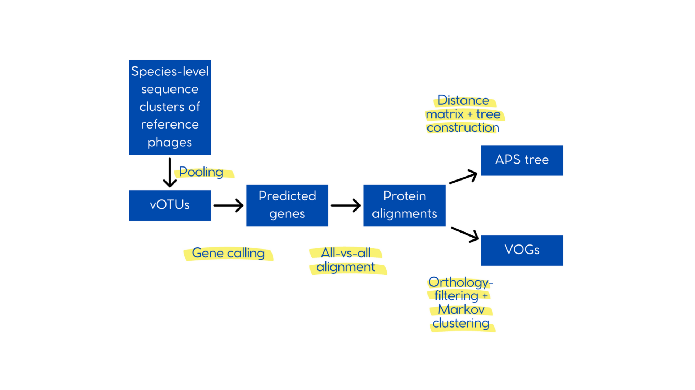

## Projet de stage M1 - Bioinformatics | Viromics

# Mise en place et automatisation du pipeline bioinformatique de la publication "Expanding known viral diversity in the healthy infant gut" de Shah et al.

Travail réalisé pour mon stage de master 1 à la plateforme GENEPII (Plateforme de GENomique à visée diagnostique et EPIdémiologique des maladies Infectieuses) des Hospices Civils de Lyon.

Ce travail est basé sur la publication de Shah et al. : Shah, S.A., Deng, L., Thorsen, J. et al. Expanding known viral diversity in the healthy infant gut. Nat Microbiol 8, 986–998 (2023). https://doi-org.docelec.univ-lyon1.fr/10.1038/s41564-023-01345-7

Les grandes étapes du pipeline bioinformatique de l'étude sont représentées dans le schéma ci-dessous :

## Données

Les données utilisées dans ce travail consistent en un ensemble de 10021 vOTUs (unités taxonomiques virales) précédemment définies dans le cadre de l’étude originale. Ces vOTUs ont été obtenues à partir d’échantillons fécaux humains, via un pipeline bioinformatique complet intégrant plusieurs étapes successives. Après extraction et enrichissement des particules virales, l’ADN a été amplifié par MDA, puis séquencé sur plateforme Illumina HiSeq X en paired-end (profondeur moyenne de 3Gb/échantillon). Les lectures ont été traitées (filtrage qualité, déréplication) avant assemblage avec SPAdes. Les contigs assemblés ont ensuite été soumis à une procédure de décontamination rigoureuse, combinant déréplication à 95 % d’ANI (average nucleotide identity) par BLAT et script personnel, annotation génique, clustering protéique, support CRISPR, et inspection manuelle des signatures virales. Les contigs viraux ainsi retenus ont été regroupés en vOTUs sur la base d’un seuil de 95 % d'identité nucléotidique. Ces vOTUs, tels que définis dans l’étude, constituent le point de départ de mon travail.

## Base de données utilisée

Afin de déterminer si les vOTUs appartiennent à des familles virales existantes, elles sont regroupées avec des séquences de phages de référence provenant de la base de données INPHARED (INfrastructure for a PHAge REference Database) (11) pour la suite du pipeline. La version utilisée par les auteurs n’étant pas précisée dans l’article, la version à ce jour publiée sur le répertoire github a été choisie pour ce travail (14Apr2025_genomes.fa) dans laquelle on retrouvait 34k séquences de phages. Ces séquences de références sont ensuite dé-répliquées suivant le même protocole que les contigs viraux (BLAT suivi d’une clusterisation à 95% d’ANI avec un script de Shah et al.) pour finalement obtenir 22260 séquences.

## Pipeline utilisé

A partir du total combiné de 32281 séquences (vOTUs + phages de référence), une succession d’étapes, visibles dans la figure ci-dessous, aboutissent à la formation d’un arbre de similarité des protéines délimité au niveau des familles de virus (VFCs) ainsi
que la formation de groupes d’orthologues viraux (VOGs).

Les différents outils nécessaires à l’exécution du pipeline ont été installés au sein d’une image Singularity, garantissant un environnement reproductible et isolé, compatible avec les infrastructures de calcul haute performance. Ce conteneur permet de maîtriser les dépendances logicielles, de limiter les conflits entre versions, et de faciliter le déploiement du pipeline sur différents systèmes. Par ailleurs, chaque étape du pipeline a fait l’objet d’un script Bash ou Python dédié. Ces scripts ont été conçus en vue d’une intégration progressive dans un gestionnaire de workflow tel que Nextflow, couramment utilisé au sein de l’équipe GenEPII, afin d’assurer une exécution automatisée, reproductible et facilement traçable du pipeline complet.

| Step                  | Tools                                       | Version                        |
| --------------------- | ------------------------------------------- | ------------------------------ |
| Phage deduplication   | Blat (15) + Shah et al. script (10)         | v36 + v1                       |
| Gene calling          | Prodigal (16)                               | v2.6.3                         |
| Protein alignments    | FASTA36 (17) / DIAMOND (18) / MMseqs2 (19)  | v36.3.8i / v2.1.12 / v17.b804f |
| APS tree creation     | Shah et al. script (10) + RapidNJ (20)      | v1 + v2.3.2                    |
| APS tree manipulation | FigTree (21) + Treetool + Phylotreelib (23) | v1.4.4 + v1 + v1.27.0          |
| VOG definition        | Shah et al. script (10) + MCL (24)          | v1 + v22.282                   |
| VOG annotation        | MUSCLE (25) + HH-suite3 (26)                | v5.3 + v3.3.0                  |

## Scripts

| Étape                 | Lien du script associé                                                                                                   | Etat         |
| --------------------- | ------------------------------------------------------------------------------------------------------------------------ | ------------ |
| Phage deduplication   | [phage deduplication avec BLAT](scripts/blat_phages.sh)                                                                  | ✅           |
| Gene calling          | [Prédiction des ORF + alignements avec FASTA36](scripts/pipeline3.sh)                                                    | ✅           |
| Protein alignments    | [FASTA36 avec prodigal](scripts/pipeline3.sh) / [DIAMOND](scripts/align_diamond.sh) / [MMseqs2](scripts/align_mmseqs.sh) | ✅ / ✅ / ✅ |
| APS tree creation     | [FASTA36](scripts/build_APStree_fasta36.sh) / [MMseqs2](scripts/build_APStree_mm.sh)                                     | ✅ / ✅      |
| APS tree manipulation |                                                                                                                          | ⚠️           |
| VOG definition        | [VOGs_def](scripts/VOGs.sh)                                                                                              | ✅           |
| VOG annotation        |                                                                                                                          | ❌           |

**build_APStree_fasta36.sh**
--NON FONCTIONNEL--
